# BAB 4: TAHAPAN PENELITIAN DAN PEMBAHASAN

## 4.1 Pendahuluan

Bab ini menjelaskan secara komprehensif tahapan penelitian yang dilakukan dalam pengembangan sistem *topic modeling* untuk analisis metadata tugas akhir. Pembahasan mencakup seluruh proses dari awal hingga akhir, meliputi: pengumpulan data, pembersihan data, *preprocessing* teks, pemodelan topik dengan LDA, evaluasi model, visualisasi hasil, dan pengembangan *dashboard* interaktif.

---

## 4.2 Tahap 1: Pengumpulan Data (Data Collection)

### 4.2.1 Konfigurasi OAI-PMH Harvester

Pengumpulan data dilakukan melalui protokol OAI-PMH (*Open Archives Initiative Protocol for Metadata Harvesting*) dari repositori institusional Universitas Widyatama. Proses ini diimplementasikan dalam notebook `01_data_collection.ipynb` dengan menggunakan kelas `OAIPMHHarvester`.

**Tabel 4.1: Konfigurasi Harvesting**

| Parameter | Nilai |
|-----------|-------|
| OAI-PMH Endpoint | `https://repository.widyatama.ac.id/oai/request` |
| Metadata Prefix | `oai_dc` (Dublin Core) |
| Set Filter | `com_123456789_15` (Final Assignment) |
| Anti-bot Bypass | cloudscraper |

### 4.2.2 Identifikasi Repositori

Sebelum melakukan harvesting, sistem melakukan identifikasi repositori untuk memvalidasi koneksi dan mendapatkan informasi dasar:

```
Repository Information:
--------------------------------------------------
repositoryName: Widyatama University
baseURL: https://repository.widyatama.ac.id/server/oai/request
protocolVersion: 2.0
adminEmail: dspace@widyatama.ac.id
earliestDatestamp: 2007-11-19T01:40:55Z
deletedRecord: transient
granularity: YYYY-MM-DDThh:mm:ssZ
```

### 4.2.3 Proses Harvesting

Proses harvesting berhasil mengumpulkan metadata dengan kecepatan rata-rata 1.203 records per detik. Data disimpan dalam format CSV di direktori `data/raw/`.

**Tabel 4.2: Hasil Pengumpulan Data**

| Metrik | Nilai |
|--------|-------|
| Total records dikumpulkan | 12.647 |
| Waktu harvesting | ~10 detik |
| Output file | `raw_metadata.csv` |
| Ukuran file | 24,9 MB |

### 4.2.4 Atribut Metadata yang Dikumpulkan

**Tabel 4.3: Struktur Data Metadata**

| Kolom | Deskripsi | Contoh |
|-------|-----------|--------|
| identifier | ID unik OAI-PMH | `oai:repository.widyatama.ac.id:123456789/14397` |
| title | Judul tugas akhir | "PENGARUH BUDAYA KESELAMATAN DAN..." |
| abstract | Abstrak penelitian | "Tujuan penelitian ini adalah..." |
| authors | Nama penulis | "Falyana, Diki Hendra" |
| date | Tanggal publikasi | "2022-01-05T05:10:37Z" |
| subjects | Kata kunci/topik | "budaya keselamatan; K3; prosedur..." |
| publisher | Penerbit/Program Studi | "Program Studi Manajemen S1" |
| types | Jenis dokumen | "Thesis" |
| language | Bahasa dokumen | "other" |
| source | Sumber tambahan | - |

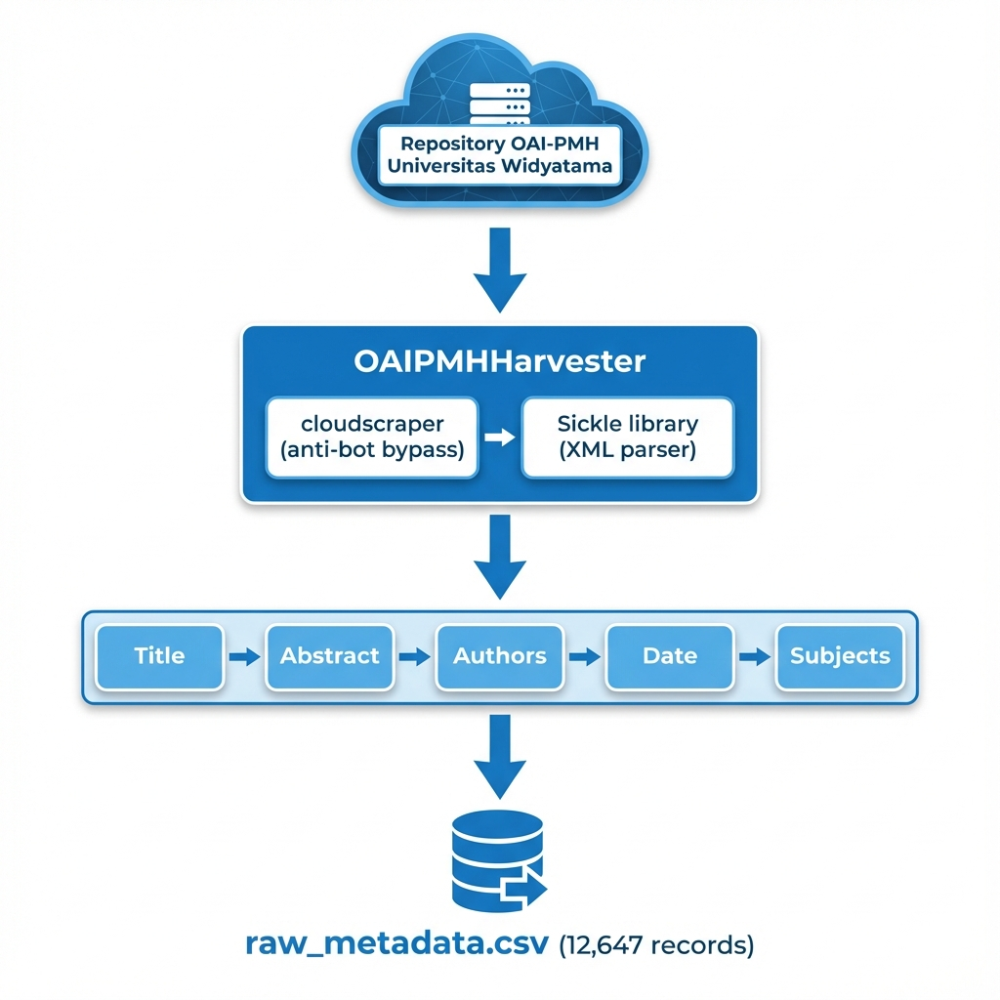

---

## 4.3 Tahap 2: Pembersihan Data (Data Cleaning)

### 4.3.1 Gambaran Umum

Tahap pembersihan data dilakukan untuk memastikan kualitas data sebelum proses *preprocessing* teks. Implementasi terdapat dalam notebook `02_data_cleaning.ipynb`.

### 4.3.2 Penghapusan Duplikasi

**Tabel 4.4: Hasil Penghapusan Duplikasi**

| Jenis Duplikasi | Jumlah Dihapus |
|-----------------|----------------|
| Exact duplicates | 0 |
| Duplicate identifiers | 0 |
| Duplicate titles | 125 |
| Duplicate abstracts | 434 |
| **Total** | **559** |

### 4.3.3 Penanganan Missing Values

**Tabel 4.5: Distribusi Missing Values**

| Kolom | Missing | Persentase |
|-------|---------|------------|
| abstract | 1 | 0,0% |
| authors | 7 | 0,1% |
| subjects | 1.213 | 10,0% |
| publisher | 89 | 0,7% |
| types | 147 | 1,2% |
| language | 2.335 | 19,3% |
| source | 12.088 | 100,0% |

- Records tanpa abstrak dihapus (1 record)
- Kolom non-esensial yang kosong diisi dengan "Tidak Diketahui"

### 4.3.4 Normalisasi Teks

Proses normalisasi dilakukan pada field teks:
1. Penghapusan whitespace berlebih
2. Penghapusan karakter kontrol
3. Trim leading/trailing whitespace

### 4.3.5 Filter Berdasarkan Panjang Abstrak

Abstrak dengan kurang dari 20 kata dihapus untuk memastikan kualitas analisis:

```python
MIN_ABSTRACT_WORDS = 20
df = df[df['abstract_word_count'] >= MIN_ABSTRACT_WORDS]
```

**Hasil**: 10 records dihapus karena abstrak terlalu pendek

### 4.3.6 Ringkasan Pembersihan Data

**Tabel 4.6: Ringkasan Hasil Pembersihan**

| Tahap | Jumlah Records |
|-------|----------------|
| Data awal (raw) | 12.647 |
| Setelah deduplikasi | 12.088 |
| Setelah filter missing | 12.087 |
| Setelah filter panjang | 12.077 |
| **Data bersih (clean)** | **12.077** |
| **Persentase data dipertahankan** | **95,5%** |

---

## 4.4 Tahap 3: Preprocessing Teks

### 4.4.1 Arsitektur Preprocessor

Preprocessing teks diimplementasikan dalam kelas `IndonesianPreprocessor` yang terdapat di file `src/preprocessor.py`. Proses ini dijalankan melalui notebook `03_preprocessing.ipynb`.

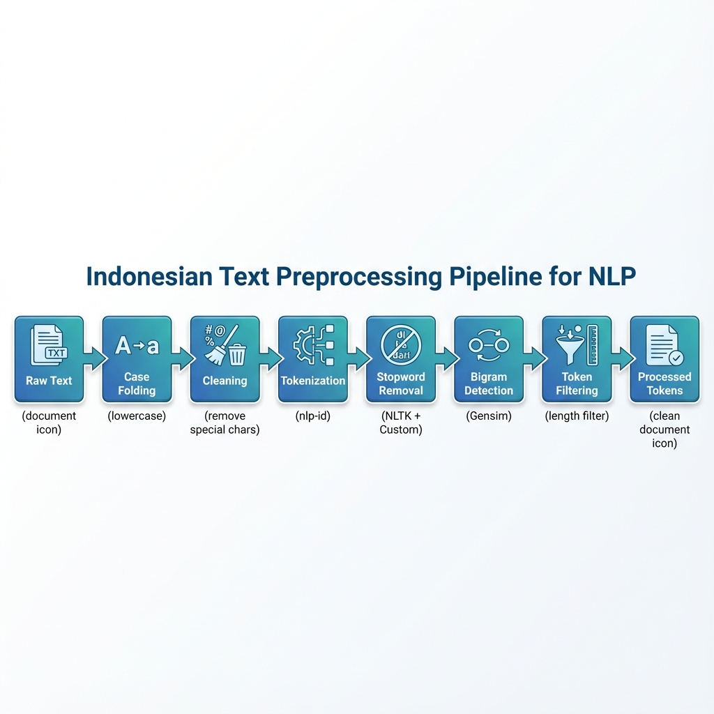

### 4.4.2 Case Folding

Seluruh teks dikonversi ke huruf kecil (*lowercase*) untuk standardisasi:

```python
text = text.lower()
```

### 4.4.3 Pembersihan Karakter Khusus

Penghapusan elemen-elemen yang tidak diperlukan:
- Angka dan karakter numerik
- Tanda baca dan simbol
- URL dan email
- Karakter non-alfabet

### 4.4.4 Tokenisasi

Tokenisasi menggunakan library `nlp-id` yang dirancang khusus untuk bahasa Indonesia:

```python
from nlp_id.tokenizer import Tokenizer
tokenizer = Tokenizer()
tokens = tokenizer.tokenize(text)
```

### 4.4.5 Stopword Removal

Penggabungan stopwords dari berbagai sumber:

**Tabel 4.7: Sumber Stopwords**

| Sumber | Jumlah | Kategori |
|--------|--------|----------|
| NLTK Indonesian | ~750 | Stopwords umum bahasa Indonesia |
| NLTK English | ~179 | Stopwords bahasa Inggris |
| PySastrawi | ~360 | Stopwords akademik |
| Custom | ~50 | Domain-specific (skripsi, penelitian, dll) |

**Contoh Custom Stopwords**:
- Kata pengantar: "skripsi", "penelitian", "tujuan", "metode"
- Kata umum akademik: "universitas", "mahasiswa", "bab", "tabel"
- Filler words: "adalah", "merupakan", "tersebut"

### 4.4.6 Deteksi Frasa (Bigram)

Menggunakan Gensim Phrases untuk mendeteksi bigram:

```python
from gensim.models.phrases import Phrases, Phraser

bigram_model = Phrases(sentences, min_count=5, threshold=10)
```

**Contoh Bigram yang Terdeteksi**:

| Domain | Contoh Bigram |
|--------|---------------|
| SDM | kinerja_karyawan, disiplin_kerja, motivasi_kerja |
| Keuangan | modal_kerja, harga_saham, bursa_efek |
| Audit | audit_internal, pengendalian_internal |
| Pemasaran | keputusan_pembelian, kualitas_pelayanan |

### 4.4.7 Token Filtering

Parameter filtering untuk mengontrol kualitas token:

**Tabel 4.8: Parameter Token Filtering**

| Parameter | Nilai | Keterangan |
|-----------|-------|------------|
| Minimum token length | 3 karakter | Menghapus kata terlalu pendek |
| Maximum token length | 50 karakter | Menghapus noise/typo |
| Minimum document length | 30 tokens | Memastikan konten memadai |

### 4.4.8 Statistik Hasil Preprocessing

**Tabel 4.9: Ringkasan Statistik Preprocessing**

| Metrik | Nilai |
|--------|-------|
| Dokumen input | 12.077 |
| Dokumen output (valid) | 11.979 |
| Dokumen dieliminasi | 98 (0,8%) |
| Rata-rata token/dokumen | 71,9 |
| Median token/dokumen | 67 |
| Min token/dokumen | 18 |
| Max token/dokumen | 563 |
| Standar deviasi | 32,0 |

---

## 4.5 Tahap 4: Pembuatan Dictionary dan Corpus

### 4.5.1 Dictionary Creation

Dictionary dibuat menggunakan Gensim dengan filtering berdasarkan frekuensi dokumen:

```python
from gensim.corpora import Dictionary

dictionary = Dictionary(processed_docs)
dictionary.filter_extremes(no_below=20, no_above=0.5)
```

**Tabel 4.10: Statistik Dictionary**

| Metrik | Nilai |
|--------|-------|
| Vocabulary awal | 35.643 kata |
| Vocabulary setelah filter | 4.241 kata |
| Reduksi vocabulary | 88,1% |
| Threshold minimum dokumen | 20 (0,17%) |
| Threshold maksimum dokumen | 50% |

### 4.5.2 Corpus Creation

Corpus dibuat dalam format Bag-of-Words (BoW):

```python
corpus = [dictionary.doc2bow(doc) for doc in processed_docs]
```

**Tabel 4.11: Statistik Corpus**

| Metrik | Nilai |
|--------|-------|
| Total dokumen | 11.979 |
| Total unique terms | 4.241 |
| Format | Matrix Market (.mm) |
| Ukuran file corpus | 4,9 MB |
| Ukuran file dictionary | 144 KB |

---

## 4.6 Tahap 5: Pemodelan Topik dengan LDA

### 4.6.1 Optimasi Jumlah Topik

Pencarian jumlah topik optimal dilakukan menggunakan *coherence score* (C_v) dengan rentang 4-14 topik:

**Tabel 4.12: Hasil Evaluasi Coherence Score**

| Jumlah Topik | Coherence Score | Waktu Training |
|--------------|-----------------|----------------|
| 4 | 0,4114 | ~15 detik |
| 6 | 0,5204 | ~18 detik |
| 8 | 0,5375 | ~22 detik |
| 10 | 0,5538 | ~25 detik |
| **12** | **0,5546** ✓ | **27 detik** |
| 14 | 0,5464 | ~30 detik |

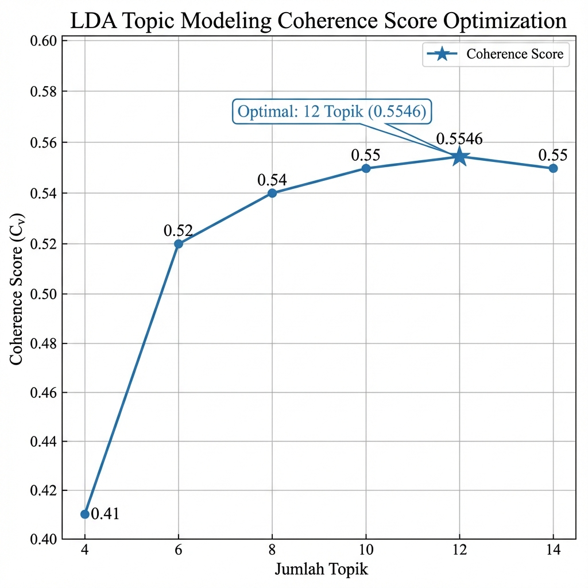

### 4.6.2 Konfigurasi Model Final

**Tabel 4.13: Hyperparameter Model LDA Final**

| Parameter | Nilai | Keterangan |
|-----------|-------|------------|
| num_topics | 12 | Jumlah topik optimal |
| passes | 20 | Iterasi melalui seluruh corpus |
| iterations | 400 | Iterasi per dokumen |
| alpha | symmetric | Prior distribusi topik-dokumen |
| eta | auto | Prior distribusi kata-topik (learned) |
| random_state | 42 | Reproducibility |
| workers | auto (multicore) | Parallel processing |

### 4.6.3 Training Model

Model dilatih menggunakan `LdaMulticore` untuk memanfaatkan parallel processing:

```python
from gensim.models import LdaMulticore

model = LdaMulticore(
    corpus=corpus,
    id2word=dictionary,
    num_topics=12,
    passes=20,
    iterations=400,
    alpha='symmetric',
    random_state=42
)
```

Waktu training: **27,3 detik**

### 4.6.4 Hasil Identifikasi Topik

**Tabel 4.14: 12 Topik yang Teridentifikasi**

| ID | Label Topik | Top 5 Kata | Jumlah Doc | % |
|----|-------------|------------|------------|---|
| 0 | Akuntansi Biaya & Manufaktur | penjualan, biaya, produksi, produk, pengendalian | 1.385 | 11,6% |
| 1 | Manajemen SDM | karyawan, kinerja_karyawan, kinerja, disiplin_kerja, pegawai | 1.448 | 12,1% |
| 2 | Keuangan Jasa & Pemerintahan Daerah | modal_kerja, pendapatan_asli, kerja, hotel, koperasi | 452 | 3,8% |
| 3 | Teknik Informatika & Pengembangan Aplikasi | sistem, aplikasi, informasi, media, perancangan | 807 | 6,7% |
| 4 | Analisis Profitabilitas Perusahaan | profitabilitas, bursa_efek, independen, ukuran, roa | 834 | 7,0% |
| 5 | Perpajakan & Sektor Publik | pajak, wajib_pajak, penerimaan_pajak, kas, pendapatan | 849 | 7,1% |
| 6 | Kepemimpinan & Industri Kreatif | karyawan, proyek, karya, film, gaya_kepemimpinan | 461 | 3,8% |
| 7 | Perbankan & Makro Ekonomi | keuangan, kinerja, bank, informasi, kondisi | 681 | 5,7% |
| 8 | Auditing & Pengendalian Internal | audit_internal, pengendalian_internal, audit, kualitas, internal | 1.483 | 12,4% |
| 9 | Sistem Informasi Manajemen | sistem_informasi, sistem, karyawan, informasi, manusia | 710 | 5,9% |
| 10 | Pasar Modal & Investasi Saham | harga_saham, saham, bursa_efek, laba, return_saham | 1.374 | 11,5% |
| 11 | Manajemen Pemasaran | konsumen, keputusan_pembelian, produk, kualitas_pelayanan, harga | 1.495 | 12,5% |

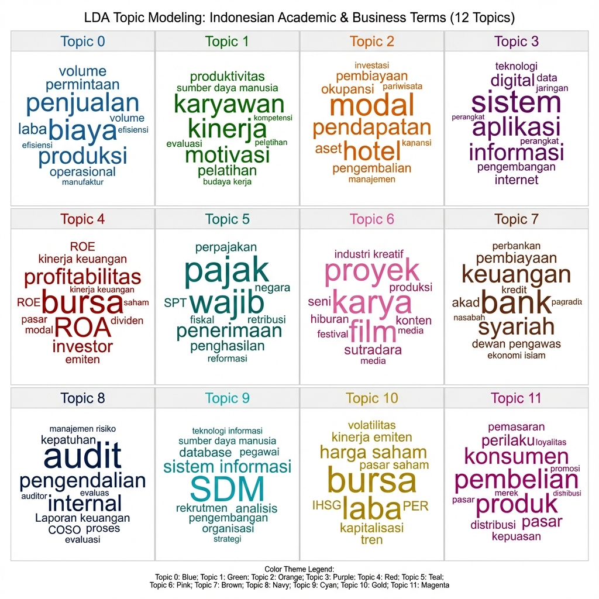

---

## 4.7 Tahap 6: Evaluasi Model

### 4.7.1 Coherence Score

**Tabel 4.15: Kriteria Interpretasi Coherence Score**

| Rentang | Interpretasi | Status |
|---------|--------------|--------|
| < 0,4 | Rendah | ❌ |
| 0,4 - 0,5 | Sedang | ⚠️ |
| **0,5 - 0,6** | **Baik** | **✓ Model ini (0,5546)** |
| 0,6 - 0,7 | Sangat Baik | - |
| > 0,7 | Excellent | - |

### 4.7.2 Interpretabilitas Topik

Evaluasi kualitatif menunjukkan bahwa semua 12 topik dapat diinterpretasikan dengan jelas:
- Kata-kata dalam setiap topik memiliki koherensi semantik tinggi
- Bigram meningkatkan interpretabilitas (contoh: "kinerja_karyawan", "audit_internal")
- Label topik dapat ditentukan secara intuitif

### 4.7.3 Distribusi Topik

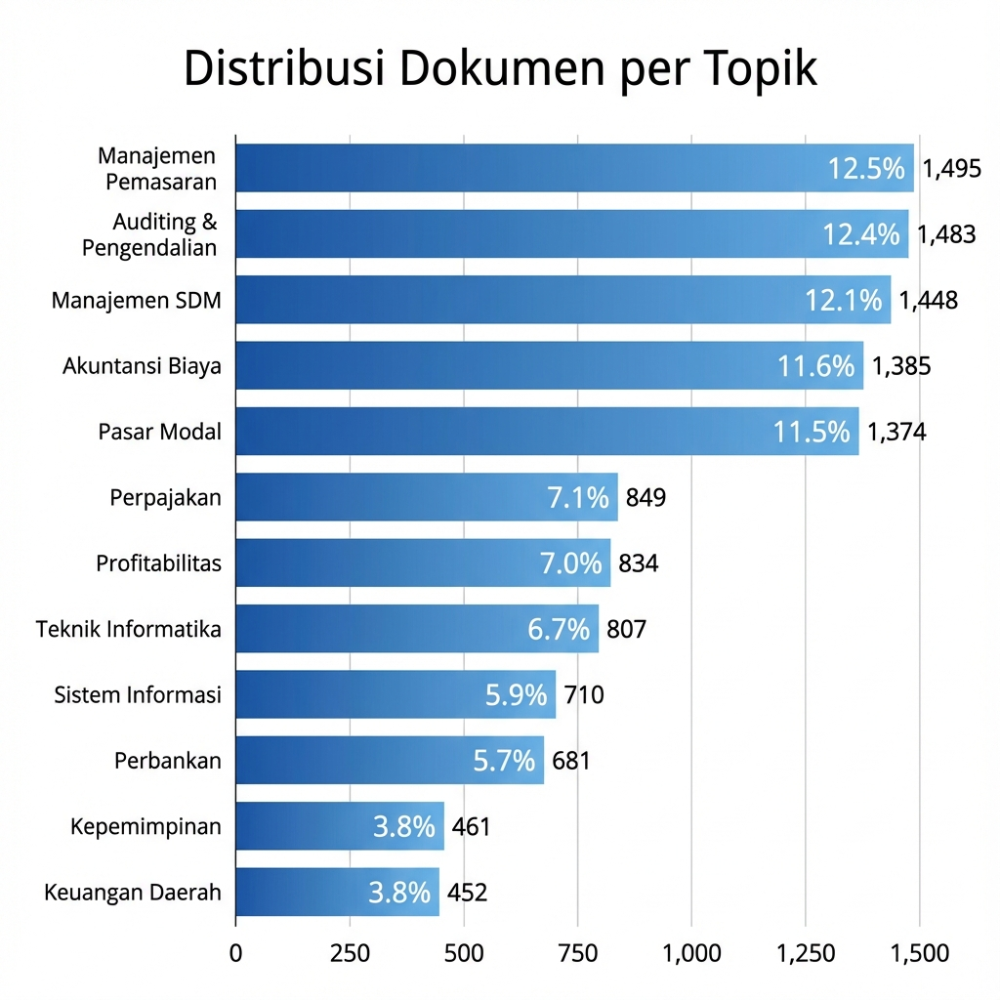

Tiga topik dengan prevalensi tertinggi:
1. **Manajemen Pemasaran** (12,5%) - 1.495 dokumen
2. **Auditing & Pengendalian Internal** (12,4%) - 1.483 dokumen
3. **Manajemen SDM** (12,1%) - 1.448 dokumen

### 4.7.4 Visualisasi pyLDAvis

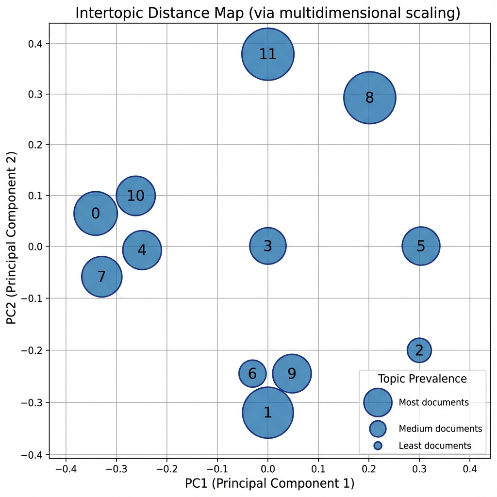

Observasi dari visualisasi:
1. **Cluster Akuntansi-Keuangan**: Topik 0, 4, 7, 10 berdekatan
2. **Cluster SDM-Organisasi**: Topik 1, 6, 9 memiliki overlap
3. **Topik Unik**: Topik 3 (Informatika) dan 11 (Pemasaran) terpisah

---

## 4.8 Tahap 7: Analisis dan Visualisasi

### 4.8.1 Jenis Visualisasi yang Dihasilkan

**Tabel 4.16: Output Visualisasi**

| File | Deskripsi | Format |
|------|-----------|--------|
| `wordclouds_all.png` | Word cloud 12 topik | PNG (1,7 MB) |
| `topic_prevalence.png` | Distribusi prevalensi topik | PNG (33 KB) |
| `topic_trends.png` | Tren topik per tahun | PNG (66 KB) |
| `topic_words.png` | Bar chart kata per topik | PNG (512 KB) |
| `coherence_score.png` | Grafik optimasi topik | PNG (123 KB) |
| `pyldavis.html` | Visualisasi interaktif | HTML (186 KB) |
| `topic_distances.png` | Jarak antar topik | PNG (171 KB) |
| `doc_topic_heatmap.png` | Heatmap dokumen-topik | PNG (39 KB) |

### 4.8.2 Analisis Tren Temporal

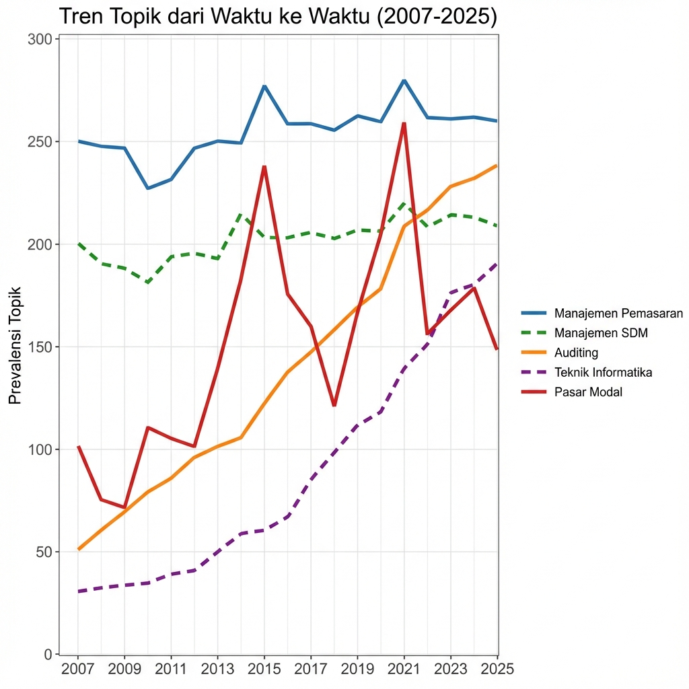

**Distribusi Dokumen per Tahun**:

| Tahun | Jumlah | Tahun | Jumlah |
|-------|--------|-------|--------|
| 2007 | 45 | 2017 | 930 |
| 2008 | 207 | 2018 | 840 |
| 2009 | 268 | 2019 | 722 |
| 2014 | 1.318 | 2020 | 782 |
| 2015 | 1.891 ↑ | 2021 | 1.489 ↑ |
| 2016 | 1.039 | 2022-2025 | 2.124 |

---

## 4.9 Tahap 8: Pengembangan Dashboard Interaktif

### 4.9.1 Arsitektur Dashboard

Dashboard dibangun menggunakan **Streamlit** dengan arsitektur multi-halaman:

```
dashboard/
├── Topic_Modeling.py          # Main entry point
├── utils.py                   # Utility functions
├── components/
│   ├── charts.py              # Chart components
│   ├── filters.py             # Filter components
│   └── utils.py               # Component utilities
└── pages/
    ├── 1_🏠_Home.py
    ├── 2_📊_Topic_Explorer.py
    ├── 3_📄_Document_Browser.py
    ├── 4_🔍_Similarity_Search.py
    ├── 5_📈_Trend_Analysis.py
    ├── 6_🎯_Topic_Comparison.py
    ├── 7_⚙️_Model_Insights.py
    └── 8_🏷️_Topic_Labeling.py
```

### 4.9.2 Wireframe dan Desain

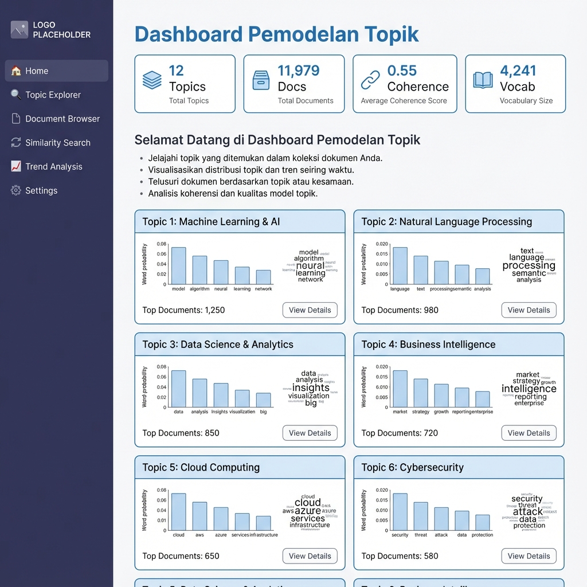

### 4.9.3 Halaman-Halaman Dashboard

#### Halaman 1: Home (Beranda)

**Fungsi**: Tampilan ringkasan dan statistik cepat

**Komponen UI**:
- Header dengan statistik model (jumlah topik, dokumen, coherence)
- Ringkasan singkat semua topik
- Navigasi cepat ke fitur utama
- Wizard pelabelan topik (jika belum ada label)

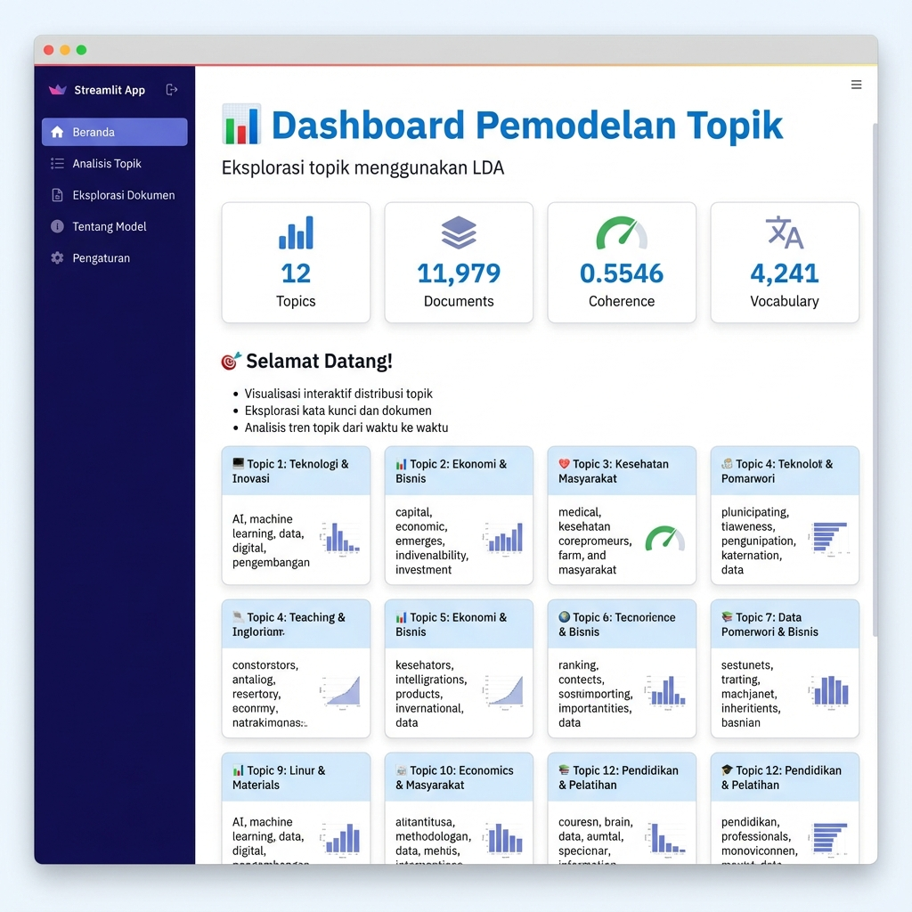

---

#### Halaman 2: Topic Explorer (Penjelajah Topik)

**Fungsi**: Eksplorasi mendalam setiap topik

**Tab yang Tersedia**:
1. **Ringkasan Topik** - Prevalensi dan statistik
2. **Word Cloud** - Visualisasi kata dominan
3. **Detail Kata** - Bar chart dan tabel bobot kata

**Fitur**:
- Selector topik pada sidebar
- Slider jumlah kata (5-30)
- Integrasi pyLDAvis interaktif

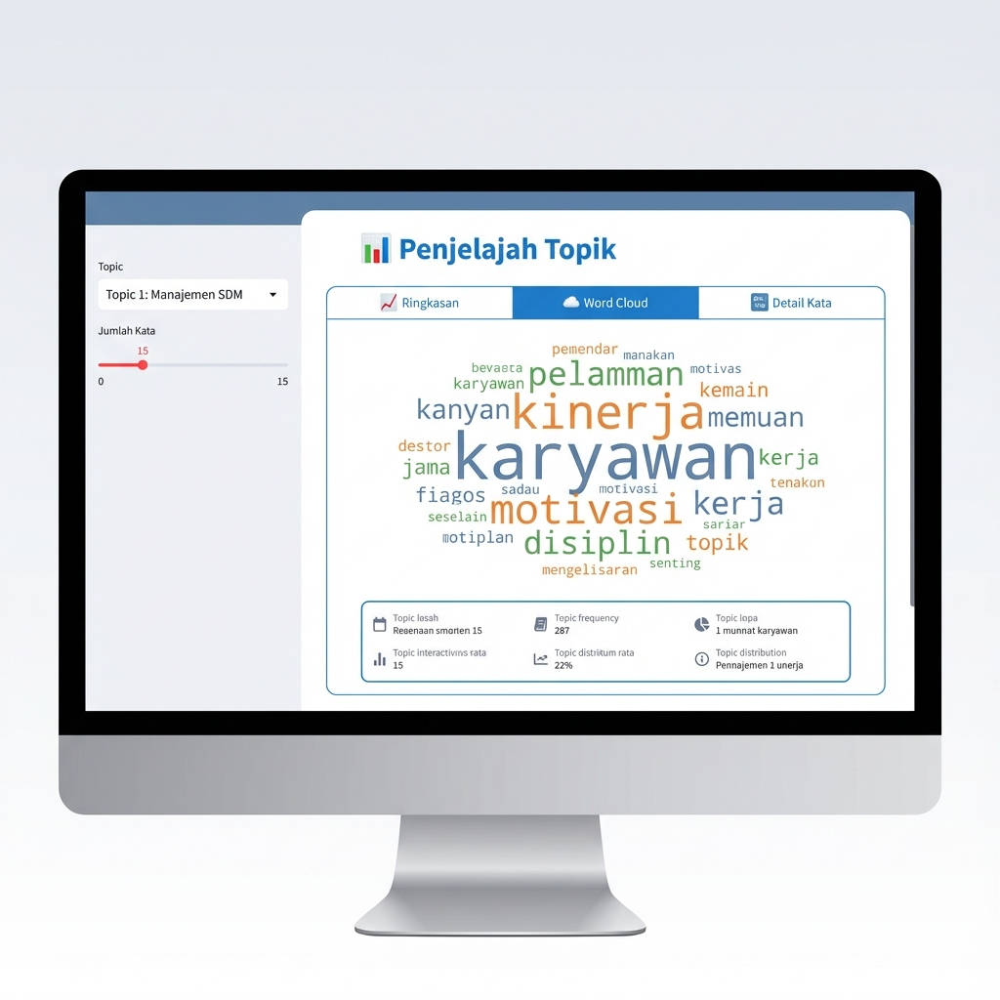

---

#### Halaman 3: Document Browser (Peramban Dokumen)

**Fungsi**: Pencarian dan filtering dokumen

**Filter yang Tersedia**:
- Pencarian kata kunci (judul/abstrak)
- Filter berdasarkan topik
- Filter probabilitas minimum
- Filter rentang tahun

**Fitur**:
- Pagination dengan konfigurasi hasil per halaman
- Ekspansi dokumen dengan detail lengkap
- Distribusi topik per dokumen
- Download hasil filter (CSV)

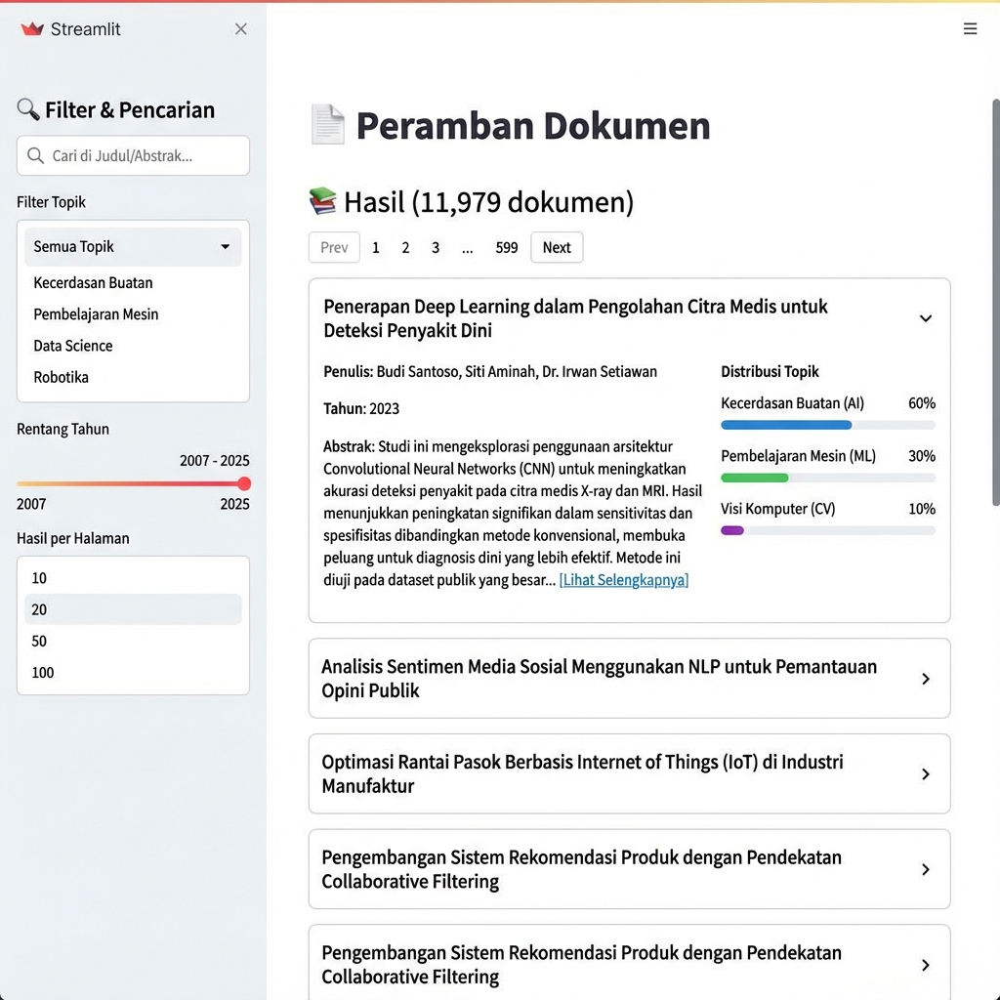

---

#### Halaman 4: Similarity Search (Pencarian Kemiripan)

**Fungsi**: Menemukan dokumen serupa

**Tab yang Tersedia**:
1. **Temukan Dokumen Serupa** - Berdasarkan dokumen yang dipilih
2. **Analisis Teks Baru** - Inference topik dari teks input

**Fitur**:
- Pencarian berbasis kemiripan distribusi topik
- Inference real-time untuk teks baru
- Preprocessing on-the-fly

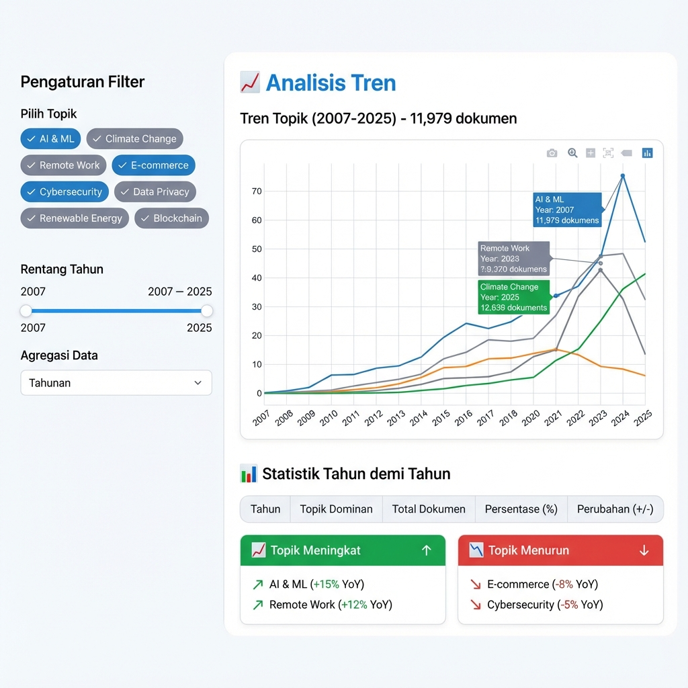

---

#### Halaman 5: Trend Analysis (Analisis Tren)

**Fungsi**: Analisis temporal topik

**Fitur**:
- Selector multiple topik
- Filter rentang tahun
- Metode agregasi (rata-rata, jumlah, hitung)
- Line chart interaktif
- Perbandingan periode awal vs terkini
- Deteksi topik naik/turun


---

#### Halaman 6: Topic Comparison (Perbandingan Topik)

**Fungsi**: Membandingkan topik secara berdampingan

**Fitur**:
- Pemilihan dua topik untuk dibandingkan
- Side-by-side word cloud
- Kata overlap dan unik
- Statistik perbandingan

---

#### Halaman 7: Model Insights (Wawasan Model)

**Fungsi**: Informasi teknis model

**Informasi yang Ditampilkan**:
- Hyperparameter model
- Statistik training
- Informasi dictionary dan corpus
- Path file model

---

#### Halaman 8: Topic Labeling (Pelabelan Topik)

**Fungsi**: Manajemen label topik custom

**Fitur**:
- Input label per topik
- Pratinjau kata-kata topik
- Simpan dan muat label (JSON)
- Saran label otomatis

[Gambar 4.14: Screenshot Halaman Topic Labeling](placeholder/gambar_4_14_screenshot_topic_labeling.md)

### 4.9.4 Teknologi yang Digunakan

**Tabel 4.17: Teknologi Dashboard**

| Komponen | Teknologi |
|----------|-----------|
| Framework | Streamlit 1.x |
| Charts | Plotly Express |
| Word Cloud | WordCloud library |
| Data Processing | Pandas, NumPy |
| Styling | Custom CSS |
| State Management | Streamlit Session State |

### 4.9.5 Cara Menjalankan Dashboard

```bash
# Instalasi dependencies
uv sync

# Jalankan dashboard
streamlit run dashboard/Topic_Modeling.py
```

Dashboard akan tersedia di `http://localhost:8501`

---

## 4.10 Pembahasan Hasil

### 4.10.1 Interpretasi Topik

#### Topik 0: Akuntansi Biaya & Manufaktur (11,6%)
Topik ini merepresentasikan penelitian di bidang akuntansi biaya dan manajemen produksi. Fokus pada analisis biaya produksi, penentuan harga pokok, dan strategi penjualan di sektor manufaktur.

#### Topik 1: Manajemen SDM (12,1%)
Topik terbesar kedua mencakup penelitian tentang pengelolaan sumber daya manusia. Bigram seperti "kinerja_karyawan", "disiplin_kerja", dan "motivasi_kerja" menunjukkan fokus pada faktor produktivitas.

#### Topik 2: Keuangan Jasa & Pemerintahan Daerah (3,8%)
Menggabungkan penelitian sektor jasa (hotel, koperasi) dan keuangan pemerintahan daerah (PAD). Topik dengan prevalensi terendah kedua.

#### Topik 3: Teknik Informatika & Pengembangan Aplikasi (6,7%)
Mencakup pengembangan sistem dan aplikasi teknologi. Kata-kata seperti "aplikasi", "perancangan", "algoritma" mencerminkan fokus pada software development.

#### Topik 4: Analisis Profitabilitas Perusahaan (7,0%)
Fokus pada analisis keuangan perusahaan publik, khususnya profitabilitas dan kinerja keuangan perusahaan terdaftar di bursa efek.

#### Topik 5: Perpajakan & Sektor Publik (7,1%)
Didominasi penelitian perpajakan: kepatuhan wajib pajak, penerimaan pajak, dan administrasi perpajakan.

#### Topik 6: Kepemimpinan & Industri Kreatif (3,8%)
Topik unik menggabungkan kepemimpinan organisasi dengan industri kreatif (film, novel). Prevalensi terendah bersama Topik 2.

#### Topik 7: Perbankan & Makro Ekonomi (5,7%)
Mencakup kinerja keuangan perbankan, termasuk bank syariah. Analisis kinerja dan valuasi bank.

#### Topik 8: Auditing & Pengendalian Internal (12,4%)
Topik terbesar ketiga fokus pada audit dan tata kelola perusahaan. Good corporate governance menjadi tema sentral.

#### Topik 9: Sistem Informasi Manajemen (5,9%)
Penerapan sistem informasi dalam organisasi, khususnya fungsi HR (rekrutmen, penggajian, seleksi).

#### Topik 10: Pasar Modal & Investasi Saham (11,5%)
Penelitian pasar modal Indonesia. Analisis fundamental saham dengan rasio keuangan.

#### Topik 11: Manajemen Pemasaran (12,5%)
Topik terbesar mencakup perilaku konsumen dan strategi pemasaran. Fokus pada faktor keputusan pembelian.

### 4.10.2 Temuan Utama

1. **Dominasi Bidang Bisnis**: Topik-topik terkait Manajemen, Akuntansi, dan Keuangan mendominasi (~70% total dokumen)

2. **Keterkaitan antar Topik**: Cluster topik menunjukkan keterkaitan akademik yang logis (contoh: Audit berdekatan dengan Akuntansi)

3. **Diversitas Penelitian**: Kehadiran topik Informatika dan Industri Kreatif menunjukkan diversifikasi program studi

4. **Tren Temporal**: Topik Pemasaran dan SDM konsisten populer sepanjang periode

### 4.10.3 Implikasi

**Implikasi Akademik**:
- Validasi LDA untuk teks akademik bahasa Indonesia
- Pentingnya preprocessing yang tepat untuk bahasa Indonesia
- Bigram meningkatkan interpretabilitas topik

**Implikasi Praktis**:
- Pemetaan lanskap penelitian institusi
- Input untuk pengembangan kurikulum
- Dasar sistem rekomendasi literatur

---

## 4.11 Keterbatasan Penelitian

1. **Sumber Data Tunggal**: Hanya dari Universitas Widyatama
2. **Fokus pada Abstrak**: Tidak mencakup full-text dokumen
3. **Keterbatasan NLP Bahasa Indonesia**: Tools lebih terbatas dibanding bahasa Inggris
4. **Distribusi Temporal tidak Merata**: Data lebih banyak di tahun 2014-2021

---

## 4.12 Ringkasan Bab

Bab ini telah menjelaskan secara komprehensif seluruh tahapan penelitian:

| Tahap | Proses | Hasil Utama |
|-------|--------|-------------|
| 1 | Data Collection | 12.647 records dari OAI-PMH |
| 2 | Data Cleaning | 12.077 records bersih (95,5%) |
| 3 | Text Preprocessing | 11.979 dokumen, 71,9 token/doc |
| 4 | Dictionary & Corpus | 4.241 vocabulary, 88,1% reduksi |
| 5 | LDA Modeling | 12 topik optimal, coherence 0,5546 |
| 6 | Evaluation | Interpretabilitas tinggi |
| 7 | Visualization | 8 jenis visualisasi |
| 8 | Dashboard | 8 halaman interaktif |

Topik dominan adalah **Manajemen Pemasaran (12,5%)**, **Auditing (12,4%)**, dan **Manajemen SDM (12,1%)**, mencerminkan fokus akademik Universitas Widyatama. Dashboard Streamlit memungkinkan eksplorasi interaktif hasil penelitian oleh berbagai stakeholder.
